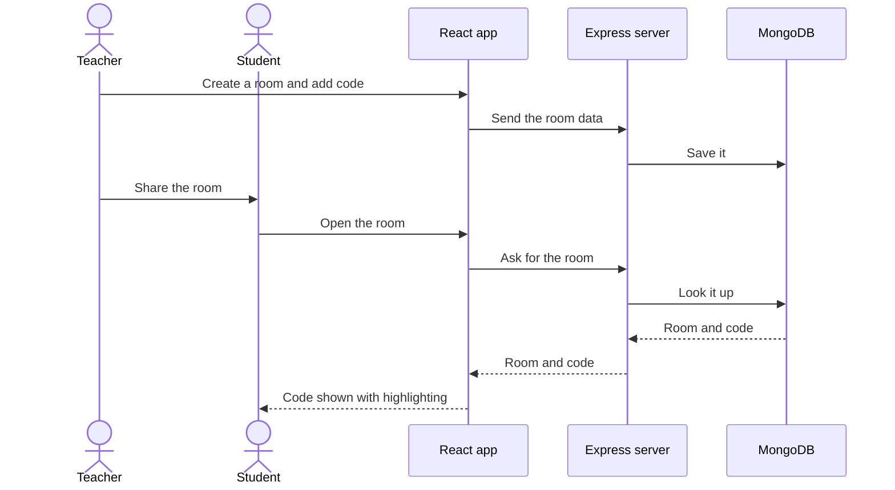

# codeRoom🚀✨

Sharing code in our college lab was slower than it needed to be, so I built a small app for it. Anyone can create a room, put their code in it and hand the room over to others. A teacher can post an example for the whole class, a student can share a solution, and nobody has to pass files around or retype anything.

Live site: [coderoom123.vercel.app](https://coderoom123.vercel.app)

## Used technologies


The front end is React with Vite and React Router, and code is displayed with Prism syntax highlighting. The back end is an Express server that stores rooms in MongoDB through Mongoose.

## How it works



## Project structure

```
codeRoom/
├── public/     # static assets
├── server/     # Express backend and MongoDB models
├── src/        # React app
├── index.html
└── vite.config.js
```
